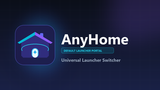
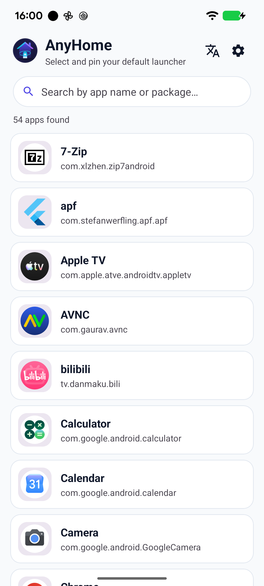
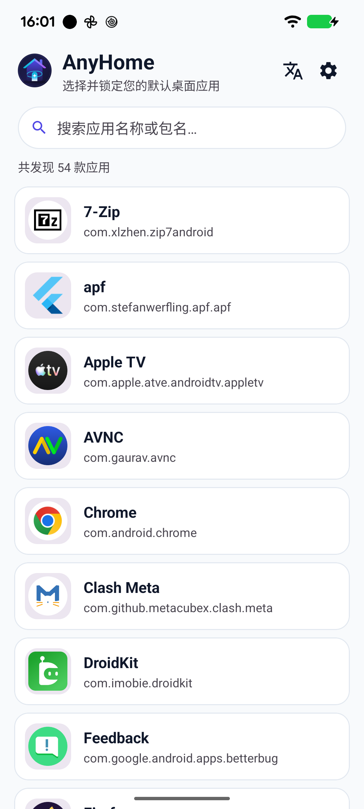

  

  
  
  
  
  

  <b><a href="#english">English</a></b> | <b><a href="#中文说明">中文说明</a></b>

---

## 📱 English

**AnyHome** is a modern, lightweight Android launcher switcher and redirector. It allows you to select **any installed application** on your phone, tablet, or Android TV and use it as your default home screen launcher.

### ✨ Features
- 🏠 **Use Any App as Launcher**: Turn any regular app, third-party launcher, or kiosk tool into your home launcher.
- 🔍 **Instant Search & Filter**: Real-time filtering by application name or package ID.
- 🎯 **Current Home Indicator**: Clearly highlights the currently configured default home app.
- 🎨 **Material 3 Design**: Clean cards, adaptive squircle icon styling, smooth spring physics animation, and edge-to-edge transparent system bars.
- 🌐 **Bilingual & Per-App Language**: Full English and Simplified Chinese support with a one-tap language switch button and native Android 13+ per-app language settings.
- ⚙️ **Direct System Settings & Reset**: Quickly jump to Android's default home app settings or clear your saved launcher selection with one click.
- 📺 **Android TV Support**: Optimized for TV navigation with Leanback launcher support and a modern banner.

### 📸 Screenshots

  
  &nbsp;&nbsp;&nbsp;&nbsp;
  

  <i>(Left: English Interface &nbsp;|&nbsp; Right: Chinese Interface)</i>

### 🚀 How to Use
1. Open **AnyHome**.
2. Browse or search for your desired application from the list.
3. Tap on the app to select and set it as your target launcher.
4. Set **AnyHome** as your system's default Home App when prompted (or via the Settings button at the top right).
5. Whenever you press the HOME button, AnyHome will seamlessly redirect to your selected application.
6. To switch or reset, reopen AnyHome and pick another app or tap **Reset**.

---

## 🇨🇳 中文说明

**AnyHome** 是一款轻量、优雅的 Android 桌面启动器重定向与切换工具。无论是手机、平板还是 Android TV 电视设备，均可将设备上**安装的任意应用**绑定并重定向为系统默认桌面。

### ✨ 核心功能
- 🏠 **任意应用设为桌面**：可将常规应用、第三方启动器或专用工具设为主屏幕桌面。
- 🔍 **毫秒级即时搜索**：支持按应用名称或包名实时筛选，百万应用即输即搜。
- 🎯 **当前桌面状态标记**：直观展示当前锁定的默认桌面徽章与对勾标识。
- 🎨 **Material 3 现代界面**：圆角卡片布局、统一应用图标规整背景、弹性触底回弹物理动画与沉浸式全透明系统状态栏/导航栏。
- 🌐 **中英双语与快捷切换**：原生支持中文与英文，顶部集成一键语言切换按钮，并适配 Android 13+ 单应用语言偏好设置。
- ⚙️ **一键重置与系统设置直达**：点击右上角齿轮直达系统默认应用配置，支持随时清除当前选定偏好。
- 📺 **Android TV 电视设备适配**：全面支持 Leanback TV 启动器模式与高清宽屏电视横幅。

### 📸 界面截图

  
  &nbsp;&nbsp;&nbsp;&nbsp;
  

  <i>（左侧：中文界面 &nbsp;|&nbsp; 右侧：英文界面）</i>

### 🚀 使用方法
1. 打开 **AnyHome** 应用。
2. 在应用列表中浏览或搜索您希望设为主屏的应用。
3. 点击该应用即可完成选定与绑定。
4. 在系统弹窗或点击右上角设置按钮中，将 **AnyHome** 设为系统的“默认主屏幕应用”。
5. 后续每次点击手机 HOME 键或手势返回桌面时，AnyHome 将无缝静默跳转至您指定的目标应用。
6. 如需更换，重新打开 AnyHome 选择新应用或点击**重置桌面**即可。

---

## 🛠️ 技术规格 / Tech Specs
- **Target SDK**: Android 17 (API 37)
- **Compile SDK**: API 36
- **Min SDK**: API 24 (Android 7.0+)
- **JDK Target**: Java 17
- **UI Framework**: Google Material 3 (Material Components 1.12.0)
- **Architecture**: MVVM + Coroutines (Dispatchers.IO) + LiveData

## 📄 License
This project is licensed under the **2-Clause BSD License**. See [LICENSE](LICENSE) for details.
